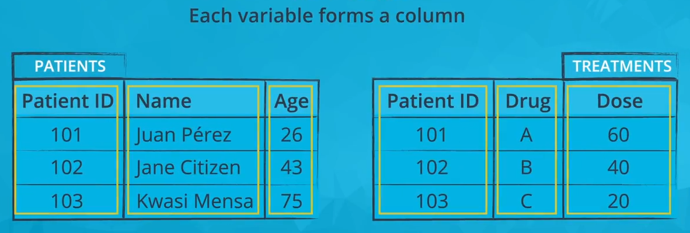

# AI Programming with Python Nanodegree from Udacity

This repo will be use to record my notes for this course.

## Matplotlib and Seaborn Chapter

We start the exploration of any datasets with univariate visualizations or **visualizations of single variables**. By looking at one variable at a time we can build an intuition for how each variable is distributed before moving on to more complicated interactions between variables. When you start looking at any dataset, keep in mind **the goals of your investigation** and explore the variables that will be key to answering your research questions.


- Bar Charts : Bar charts are used for **Qualitative variables**. In a bar chart, each level of the categorical variable is depicted with a bar, whose height indicates the frequency of data points that take on that level. A basic bar chart of frequencies can be created through the use of seaborn's `countplot`.

 ```bash
sns.countplot(data = df, x = 'cat_var')

 ```
 You can also add color 

 ```bash
 
base_color = sns.color_palette()[i]

sns.countplot(data = df, x = 'cat_var', color = base_color)

 ```

 For nominal-type data, one common operation is to sort the data in terms of frequency. With our data in a pandas DataFrame, we can use various DataFrame methods to compute and extract an ordering, then set that ordering on the "order" parameter :

 ```bash
 
base_color = sns.color_palette()[i]

cat_order = df['cat_var'].value_counts().index

sns.countplot(data = df, x = 'cat_var', color = base_color, order = cat_order)

 ```
We can also visualize data using a barplot : 

```bash
na_counts = df.isna().sum()
base_color = sns.color_palette()[0]
sns.barplot(na_counts.index.values, na_counts, color = base_color)

```

The first argument to the function contains the x-values(column names), the second argument the y-values (our counts).

And other way of visualizing qualitative data is by using a pie chart or a donut chart. But it is not the optimal way. 

Most of the time you will probably prefer a barplot over a pie chart, or a donut chart.

But when to use a pie chart or a donut chart??

- Showing how the data is broken down into parts
- Plotting a small number of slices (two or three)


- Histograms are used for **Quantitative variables**

### What is a Tidy Data

In short, a tidy dataset is a tabular dataset where : 

 - Each variable is a column
 - Each observation is a row
 - Each type of observational unit is a table

 